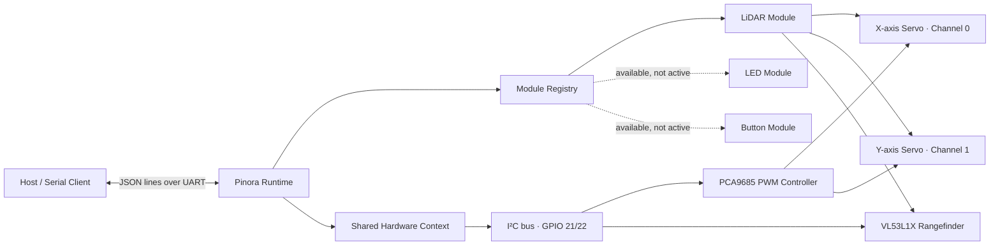

<div align="center">

# Pinora Firmware

### A modular Rust firmware foundation for ESP32 robotics and connected hardware

[](#project-status)
[](#project-status)
[](#hardware)
[](https://www.rust-lang.org/)

**Build modules. Register them. Control them through one simple protocol.**

> [!CAUTION]
> **Pinora v0.1.0 is a pre-alpha development build.** The architecture, wiring,
> protocol, APIs, and module behavior may change without notice. It is intended
> for experimentation and active development—not production or safety-critical use.

</div>

---

## What is Pinora?

Pinora is an experimental ESP32 firmware framework written in Rust. It provides a
shared foundation for building small robotics and embedded systems from reusable
hardware modules.

Each module owns its behavior, receives typed commands, and publishes registration
or event messages as newline-delimited JSON over the serial connection. The current
firmware brings two servos and a VL53L1X time-of-flight sensor together as a simple
two-axis LiDAR scanner.

The project currently explores:

- A common `Module` interface for independently controlled hardware
- Runtime UUIDs and human-readable lookup IDs for module discovery
- Parent/child relationships for composite modules
- Shared I²C access across multiple devices
- Typed JSON commands and events using Serde
- PCA9685-based servo control
- VL53L1X distance measurement
- A two-axis, region-of-interest LiDAR scanning workflow

## Project status

| | State |
|---|---|
| **Release** | `v0.1.0` |
| **Maturity** | **Pre-alpha** |
| **Primary target** | ESP32 / `xtensa-esp32-espidf` |
| **ESP-IDF** | `v5.5.3` |
| **Rust edition** | 2021 |
| **Interface** | Newline-delimited JSON over UART |

What **pre-alpha** means here:

- Interfaces and message formats are not stable.
- Hardware values are currently configured in source.
- Automated hardware tests do not exist yet.
- Error recovery and input validation are incomplete.
- Some modules are implemented but are not wired into the active application.
- Expect rough edges, active refactoring, and breaking changes.

## Architecture



At startup, the firmware:

1. Initializes ESP-IDF logging and UART0.
2. Creates a 400 kHz I²C bus on GPIO 21 (SDA) and GPIO 22 (SCL).
3. Initializes the PCA9685 PWM controller and VL53L1X sensor.
4. Builds the LiDAR module and its two child servo modules.
5. Emits module registration and initial-state messages.
6. Runs a 10 ms update loop while a separate thread reads serial commands.

## Repository structure

```text
.
├── .cargo/
│   └── config.toml          # ESP32 target, linker, runner, and ESP-IDF settings
├── .github/
│   └── workflows/
│       └── rust_ci.yml      # Build, formatting, and Clippy checks
├── src/
│   ├── core/
│   │   ├── hardware.rs      # GPIO wrappers, shared I²C/PWM, hardware context
│   │   └── modulecore.rs    # Module identity, trait, and message emitters
│   ├── module/
│   │   ├── buttonmodule.rs  # Debounced digital-input button
│   │   ├── ledmodule.rs     # LED brightness and toggle control
│   │   ├── lidar.rs         # Two-axis scanning and point-map orchestration
│   │   ├── range_finder.rs  # VL53L1X ranging and configuration
│   │   └── servomodule.rs   # PCA9685 servo positioning and limits
│   ├── protocol/
│   │   ├── command.rs       # Incoming command schema
│   │   ├── module_event.rs  # Outgoing event schema
│   │   ├── registration.rs  # Module discovery messages
│   │   └── global_definitions.rs
│   ├── utilities/
│   │   ├── logger.rs        # Structured system-log events
│   │   └── math.rs          # Range mapping and PWM conversion helpers
│   └── main.rs              # Hardware setup, registry, UART reader, main loop
├── build.rs                 # Exposes ESP-IDF build environment
├── Cargo.toml               # Package metadata and dependencies
├── pre-script.rhai          # ESP target template configuration
├── rust-toolchain.toml      # Selects the Espressif Rust toolchain
└── sdkconfig.defaults       # ESP-IDF / FreeRTOS stack-size defaults
```

## Module model

Every hardware component implements the shared `Module` trait and carries a
`ModuleCore` containing:

- A UUID generated on every boot
- A `ModuleType`
- A manual, human-readable lookup ID

Composite modules can register children through `parent_id`. For example, the
LiDAR module owns `servo_x`, `servo_y`, and `rangefinder`. This makes the physical
system discoverable without hard-coding runtime UUIDs in the host application.

| Module | Implemented | Active in `main` | Purpose |
|---|:---:|:---:|---|
| LiDAR | ✅ | ✅ | Coordinates scanning, servos, ROI, and point collection |
| Rangefinder | ✅ | ✅ as LiDAR child | Reads VL53L1X distance measurements |
| Servo | ✅ | ✅ as LiDAR child | Controls a PCA9685 PWM channel |
| LED | ✅ | ❌ | PWM brightness and toggle commands |
| Button | ✅ | ❌ | Debounced input and click events |

## Hardware

The active v0.1.0 configuration expects:

- An ESP32 development board
- A PCA9685 16-channel PWM controller
- Two compatible hobby servos
- A VL53L1X time-of-flight distance sensor
- A shared I²C bus on:
  - **SDA:** GPIO 21
  - **SCL:** GPIO 22
  - **Clock:** 400 kHz
- Servo X on PCA9685 channel `C0`
- Servo Y on PCA9685 channel `C1`

> [!WARNING]
> Do not power servos directly from the ESP32's 3.3 V pin. Use a suitable external
> supply, connect the grounds, verify voltage requirements, and test with the
> mechanism unloaded. The current firmware moves both servos during initialization.

Servo defaults are currently defined in `src/module/lidar.rs`:

| Setting | Value |
|---|---:|
| Physical angle range | 0° to 180° |
| Logical pivot range | -90° to +90° |
| Center offset | 90° |
| Pulse range | 500–2500 µs |

These values must be calibrated for the actual servos and mechanical assembly.

## Getting started

### Prerequisites

Install the ESP Rust development environment and ensure these commands are
available:

- `cargo`
- the Espressif `esp` Rust toolchain
- `ldproxy`
- `espflash`

This repository selects the `esp` toolchain automatically and targets
`xtensa-esp32-espidf`.

### Build

```bash
git clone <your-repository-url>
cd rust_esp32_basedv0
cargo build
```

For a size-optimized release build:

```bash
cargo build --release
```

### Flash and monitor

Connect the ESP32 over USB, then run:

```bash
cargo run --release
```

The Cargo runner is configured as `espflash flash --monitor`, so this command
builds the firmware, flashes the board, and opens the serial monitor.

If more than one serial device is connected, select the correct port through
`espflash` when prompted.

## Serial protocol

Pinora currently uses **one JSON object per line**:

- Commands travel from the host to the ESP32.
- Registrations, module events, and system logs travel from the ESP32 to the host.
- The `id` field is the runtime UUID emitted when a module registers.

### Registration

On startup, each module announces itself:

```json
{
  "type": "Registration",
  "payload": {
    "id": "generated-runtime-uuid",
    "module_type": "Servo",
    "lool_up_id": "servo_x",
    "parent_id": "parent-lidar-uuid"
  }
}
```

> [!NOTE]
> `lool_up_id` is the current wire-protocol spelling. It is retained here to match
> v0.1.0 exactly and may be renamed in a future breaking revision.

### Start a LiDAR scan

Send the following as a single line, replacing the ID with the registered LiDAR
UUID:

```json
{"id":"lidar-runtime-uuid","module_type":"Lidar","payload":{"command":"StartScan"}}
```

### Change the scan step

```json
{"id":"lidar-runtime-uuid","module_type":"Lidar","payload":{"command":"SetStep","step":5}}
```

### Move to a position

```json
{"id":"lidar-runtime-uuid","module_type":"Lidar","payload":{"command":"MovePos","p":{"x":15,"y":-10}}}
```

### Set a region of interest

```json
{"id":"lidar-runtime-uuid","module_type":"Lidar","payload":{"command":"Roi","min":{"x":45,"y":-30},"max":{"x":-45,"y":30}}}
```

The command and event enums in `src/protocol/` are the source of truth while the
protocol is evolving.

## Current limitations

- The firmware currently activates only the composite LiDAR path.
- Pin assignments, PWM channels, servo calibration, and scan defaults are hard-coded.
- Module UUIDs change after every restart.
- UART is the only host transport; Wi-Fi and Bluetooth are not initialized.
- The scan loop advances based on firmware ticks rather than confirmed servo settling.
- The collected point map is not currently emitted when a full scan completes.
- Standalone range events are currently disabled in the rangefinder update loop.
- Some low-level operations still use `unwrap()` and need safer recovery.
- No hardware-in-the-loop or unit test suite is included yet.
- Protocol naming and schemas require cleanup before stabilization.

## Roadmap

The direction for Pinora after this pre-alpha foundation:

- [ ] Stabilize and version the serial protocol
- [ ] Move board pins and module calibration into configuration
- [ ] Emit completed LiDAR point maps
- [ ] Add scan timing, servo settling, and bounds validation
- [ ] Persist stable module identities between boots
- [ ] Activate standalone LED and button examples
- [ ] Add Wi-Fi and/or Bluetooth transport
- [ ] Add unit, protocol, and hardware-in-the-loop tests
- [ ] Improve recovery from missing or disconnected peripherals
- [ ] Add wiring diagrams and supported-board profiles

## Development checks

Before opening a change:

```bash
cargo fmt --all -- --check
cargo clippy --all-targets --all-features --workspace -- -D warnings
cargo build --release
```

The included GitHub Actions workflow runs the same build, formatting, and Clippy
checks for pull requests.

## Contributing

Pinora is at its most experimental stage, so focused issues and small pull
requests are especially useful. When contributing:

1. Describe the board and peripherals used.
2. Document any changes to pins, addresses, or calibration.
3. Include an example for protocol changes.
4. Keep hardware modules isolated behind the common module interface.
5. Clearly call out behavior that was not tested on physical hardware.

## License

No license has been added yet. Until one is provided, the source remains under
the copyright of its author and should not be assumed to be open-source licensed.

---

<div align="center">

**Pinora v0.1.0 · Pre-alpha**

_A small Rust foundation for hardware that wants to become a system._

</div>
